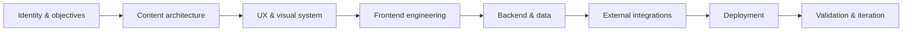

<!--
╔══════════════════════════════════════════════════════════════════════╗
║                                                                      ║
║                     C R E S T   I N T E R A C T I V E                ║
║                                                                      ║
║              Independent full-stack web development studio           ║
║                                                                      ║
╚══════════════════════════════════════════════════════════════════════╝
-->

<p align="center">
  <a href="https://crest-interactive.com">
    
  </a>
</p>

<h1 align="center">CREST INTERACTIVE</h1>

<p align="center">
  <strong>Independent full-stack web development by Luno.</strong>
</p>

<p align="center">
  Designed with identity. Engineered as a system. Shipped to production.
</p>

<p align="center">
  <a href="https://crest-interactive.com">
    
  </a>
  <a href="mailto:info@crest-interactive.com">
    
  </a>
  
</p>

<p align="center">
  
</p>

---

## About CREST

**CREST INTERACTIVE is the independent studio identity of Luno**, a full-stack web developer based in Switzerland.

I design and engineer websites that function as complete digital products—not isolated landing pages, disconnected templates or visual mock-ups that never survive contact with production.

My work covers the entire path:

```text
Strategy → Structure → Design → Frontend → Backend → Integrations → Deployment → Iteration
```

That can mean a high-character public website, a bilingual content platform, an integrated shop, a booking workflow, a protected client portal, an internal administration system—or all of them working together.

> **A website is not finished when it looks good locally.**
> It is finished when real people can use it, the owner can operate it, and the system can continue evolving after launch.

---

## The Current Chapter

For years, CREST explored ambitious concepts across gaming, telemetry, interfaces and digital worlds.

Those projects developed the underlying skills—but the direction is now sharper:

### CREST builds and ships full-stack web products.

No more permanent prototypes.

No fictional release calendars.

No presenting unfinished concepts as established products.

The focus is now on software that reaches production, solves a real problem and remains maintainable once it gets there.

---

## What I Build

|     | Capability                  | What that includes                                                                                            |
| :-: | --------------------------- | ------------------------------------------------------------------------------------------------------------- |
|  🌐 | **Brand Websites**          | Custom visual systems, responsive interfaces, structured content, animation and strong brand translation      |
|  ⚙️ | **Full-Stack Applications** | Application logic, authentication, databases, APIs, forms, dashboards and protected areas                     |
|  🛒 | **Commerce Systems**        | Product catalogues, carts, Stripe Checkout, order workflows, shipping logic and administrative tooling        |
| 🗂️ | **CMS & Admin Portals**     | Content management, media workflows, inquiries, user permissions and operational controls                     |
|  📬 | **Booking & Communication** | Contact systems, transactional email, inquiry management and structured booking workflows                     |
|  🚀 | **Production Deployment**   | Environment configuration, DNS, hosting, proxying, migrations, launch validation and ongoing releases         |
|  🔎 | **Technical Foundations**   | SEO, metadata, structured data, accessibility, performance, security boundaries and maintainable architecture |
|  🔄 | **Redesigns & Migrations**  | Replacing limited builder websites with custom systems without losing the existing identity or content        |

---

## Featured Build

<table>
<tr>
<td valign="top" width="62%">

### Unexpected Fall — Official Band Platform

A custom bilingual website and operational platform for Swiss alternative-rock band **Unexpected Fall**.

The project extends far beyond a conventional band homepage. It combines the public brand experience, music and media content, event information, merchandise, booking resources and private administration within one cohesive application.

#### Public experience

* Bilingual German and English interface
* Custom art direction and responsive visual system
* Music, shows, gallery, videos, lyrics and band content
* Merchandise catalogue and product presentation
* Structured booking and contact workflows
* Complete SEO and social-sharing foundation
* Legal, privacy, commerce and shipping surfaces

#### Application layer

* Server-side Stripe Checkout integration
* Catalogue-driven merchandise system
* Protected promoter and electronic press-kit area
* Private administration portal
* Inquiry and conversation management
* Content and media management
* Maintenance and operational controls
* Transactional email integration
* Deployment architecture for conventional Node.js hosting

</td>
<td valign="top" width="38%">

### Project Profile

```yaml
type: Full-stack web platform
sector: Music and entertainment
languages:
  - German
  - English
status: Production launch
source: Private
```

### Core Stack

```text
Next.js
React
TypeScript
Tailwind CSS
Node.js
Stripe
Resend
SQL
Cloudflare
Infomaniak
```

<p>
  <a href="https://unexpectedfall.ch">
    
  </a>
</p>

<p>
  
  
  
</p>

</td>
</tr>
</table>

---

## How a CREST Project Comes Together



The interface is not treated as decoration applied after the technical work.

The public experience, backend behavior, administrative workflow and deployment architecture are designed as parts of the same product.

---

## Technology Toolbox

<p align="center">
  
</p>

<table>
<tr>
<td valign="top" width="25%">

### Frontend

* Next.js
* React
* TypeScript
* Tailwind CSS
* Responsive UI
* Component systems
* Accessible interaction
* Motion and transitions

</td>
<td valign="top" width="25%">

### Backend

* Node.js
* Server-side rendering
* API routes
* Authentication
* SQL databases
* MongoDB
* Data validation
* Application security

</td>
<td valign="top" width="25%">

### Integrations

* Stripe
* Transactional email
* Content workflows
* File and media handling
* External APIs
* Booking systems
* Analytics
* Structured metadata

</td>
<td valign="top" width="25%">

### Delivery

* Git and GitHub
* CI validation
* Docker
* Cloudflare
* Node.js hosting
* Infomaniak
* DNS and TLS
* Production migrations

</td>
</tr>
</table>

> The stack is selected around the product—not used as a substitute for understanding it.

---

## Engineering Principles

### 01 — Ship the whole product

A polished homepage is not enough when the forms fail, the owner cannot update content or deployment requires rebuilding the project from memory.

Production, administration and maintainability are part of the deliverable.

### 02 — Preserve identity

A website should look like the business, artist or organisation it represents—not like the framework used to build it.

Reusable engineering should support distinct design, not erase it.

### 03 — Build deliberately

Dependencies, abstractions and integrations must earn their place.

Complexity is accepted when it solves a real requirement—not because it makes the architecture sound impressive.

### 04 — Design the private side too

The administrator, editor or owner is also a user.

Internal tools deserve logical information architecture, clear states, cohesive styling and efficient workflows.

### 05 — Treat deployment as engineering

Environment variables, persistent data, migrations, email configuration, payment modes, proxies, DNS and launch validation are not an afterthought.

A product that cannot be deployed reliably is still a prototype.

---

## Current Focus

```typescript
const crest = {
  identity: "Independent full-stack web studio",
  founder: "Luno",
  location: "Switzerland",

  building: [
    "Custom production websites",
    "Commerce and booking platforms",
    "Private administration systems",
    "Reusable full-stack foundations",
  ],

  priorities: [
    "Distinctive design",
    "Maintainable architecture",
    "Real-world deployment",
    "Long-term ownership",
  ],

  status: "Shipping",
};
```

Right now, the focus is on:

* Bringing the Unexpected Fall platform fully into production
* Developing CREST into a practical full-stack web studio
* Building websites for artists, independent brands and small businesses
* Refining repeatable foundations for commerce, content, administration and deployment
* Turning increasingly ambitious local builds into stable public products

---

## A Note on Neo RP and NeoLog

<details>
<summary><strong>What happened to the earlier CREST projects?</strong></summary>

<br />

**Neo RP** and **NeoLog** were ambitious development concepts created during an earlier stage of CREST.

They involved extensive experimentation with:

* Interface and design systems
* Roleplay mechanics and economy design
* Telemetry and data visualisation
* Application architecture
* Backend logic
* Product identity
* Long-term ecosystem planning

Neither project ultimately became a complete public product.

They are no longer presented as active commercial releases or used to define the current direction of CREST.

Their value was developmental: they helped establish the technical curiosity, interface discipline and systems thinking now being applied to production web development.

The prototypes stayed behind.

The experience did not.

</details>

---

## Working With CREST

CREST is suited to projects that need more than a generic page assembled from interchangeable sections.

Typical engagements include:

* A completely custom website for a business, artist or organisation
* A redesign of an outdated or difficult-to-manage website
* A migration away from restrictive website builders
* A shop or catalogue with integrated payments
* A booking, inquiry or application workflow
* A private portal for customers, promoters or staff
* A custom administration interface
* Technical launch preparation and deployment
* Continued improvements after the initial release

The best fit is a project where **design identity and technical capability both matter**.

<p align="center">
  <a href="mailto:founder@crest-interactive.com">
    
  </a>
</p>

---

## Public GitHub Activity

<details>
<summary><strong>Open public development telemetry</strong></summary>

<br />

<p align="center">
  
  
</p>

<p align="center">
  
</p>

<p align="center">
  <sub>
    Most active production work is maintained in private repositories.
    Public statistics therefore represent only part of the development activity behind CREST.
  </sub>
</p>

</details>

---

## Find CREST

<p align="center">
  <a href="https://github.com/CREST-Interactive">
    
  </a>
  <a href="https://crest-interactive.com">
    
  </a>
  <a href="mailto:founder@crest-interactive.com">
    
  </a>
</p>

<p align="center">
  
</p>

---

<p align="center">
  <strong>Concepts taught the lessons. Production proves them.</strong>
</p>

<p align="center">
  <sub>
    Made with intent. Engineered end to end.<br />
    © 2026 CREST INTERACTIVE · Switzerland
  </sub>
</p>

<p align="center">
  
</p>
