<!--
  CREST INTERACTIVE profile README — GitHub-native edition.

  Design goals:
  - One local hero visual only.
  - Native GitHub interaction through details/summary, anchors and callouts.
  - Live public repository data generated by GitHub Actions.
  - No external badge, statistics, typing-animation or image-card services.
-->

<picture>
  <source media="(prefers-color-scheme: dark)" srcset="./assets/crest-console-dark.svg">
  <source media="(prefers-color-scheme: light)" srcset="./assets/crest-console-light.svg">
  
</picture>

<p align="center">
  <strong>
    <a href="#-enter-the-system">ENTER THE SYSTEM</a>
    &nbsp;&nbsp;·&nbsp;&nbsp;
    <a href="#-featured-build">FEATURED BUILD</a>
    &nbsp;&nbsp;·&nbsp;&nbsp;
    <a href="#-live-signal">LIVE SIGNAL</a>
    &nbsp;&nbsp;·&nbsp;&nbsp;
    <a href="#-work-with-crest">START A PROJECT</a>
  </strong>
</p>

---

## ⌁ Enter the system

```console
crest@studio:~$ whoami

Luno
Independent full-stack web developer
CREST INTERACTIVE · Switzerland

crest@studio:~$ mission

Turn identity, content and operational requirements
into production websites that people can actually use.
```

> [!IMPORTANT]
> **CREST is no longer defined by concepts that stayed in development.**  
> The current direction is production web work: public experiences, private systems, commerce, booking and reliable deployment.

<table>
<tr>
<td width="25%" align="center">
  <strong>IDENTITY</strong><br>
  <sub>Custom visual direction</sub>
</td>
<td width="25%" align="center">
  <strong>APPLICATION</strong><br>
  <sub>Frontend + backend</sub>
</td>
<td width="25%" align="center">
  <strong>OPERATIONS</strong><br>
  <sub>Admin + workflows</sub>
</td>
<td width="25%" align="center">
  <strong>PRODUCTION</strong><br>
  <sub>Deploy + maintain</sub>
</td>
</tr>
</table>

---

## ◫ Choose a route

<details open>
<summary><strong>01 — I need a website that does not look like a template</strong></summary>

<br>

A brand-led public website with a deliberate visual language, responsive behavior and a content structure designed around the actual business, artist or organisation.

**Typical system**

```text
Brand identity
   └── Content architecture
         └── Responsive interface
               ├── SEO and structured metadata
               ├── Media and storytelling
               └── Conversion paths
```

**Built for:** artists, independent brands, small businesses, launches and redesigns.

</details>

<details>
<summary><strong>02 — I need commerce, booking or an actual workflow</strong></summary>

<br>

A website that does more than present information. Customers can buy, inquire, book, submit or move through a structured process.

| Capability | Examples |
|---|---|
| Commerce | Product catalogues, carts, Stripe Checkout, shipping logic |
| Booking | Availability, inquiry forms, structured request flows |
| Communication | Transactional email, status updates, conversation handling |
| Validation | Server-side rules, security boundaries, error states |

</details>

<details>
<summary><strong>03 — I need the private side to stop being painful</strong></summary>

<br>

An owner-facing or staff-facing system that is designed with the same care as the public interface.

- Content and media management
- Inquiry and conversation views
- Maintenance controls
- Protected resources
- Operational settings
- Clear empty, loading, success and error states

> [!NOTE]
> The administrator, editor and owner are users too. Internal tooling should not feel like an afterthought.

</details>

<details>
<summary><strong>04 — I already have a website, but it is trapped in a builder</strong></summary>

<br>

A migration or redesign that preserves what is worth keeping while replacing the structural limitations underneath it.

```diff
- Generic sections
- Restrictive editor logic
- Fragmented integrations
- Unclear ownership

+ Custom architecture
+ Maintainable source code
+ Purpose-built workflows
+ Production deployment
```

</details>

---

## ◈ Featured build

<table>
<tr>
<td width="65%" valign="top">

### Unexpected Fall — official band platform

A custom bilingual website and operational platform for Swiss alternative-rock band **Unexpected Fall**.

The system joins public identity, music and media content, live-show information, merchandise, booking resources and private administration inside one application.

</td>
<td width="35%" valign="top">

```yaml
type: full-stack platform
sector: music
languages: [DE, EN]
source: private
delivery: production-oriented
```

</td>
</tr>
</table>

<details open>
<summary><strong>Open public experience</strong></summary>

<br>

- German and English interface
- Custom responsive visual system
- Music, shows, gallery, video and lyrics surfaces
- Merchandise catalogue and product pages
- Booking and contact workflows
- SEO, metadata, legal and social-sharing foundations

</details>

<details>
<summary><strong>Open application layer</strong></summary>

<br>

- Server-side Stripe Checkout
- Catalogue-driven commerce
- Protected promoter resources
- Private administration portal
- Inquiry and content management
- Transactional email
- Environment configuration and deployment architecture

</details>

<details>
<summary><strong>Open system map</strong></summary>

<br>

```text
PUBLIC EXPERIENCE
├── Brand / content / media
├── Shows / booking / contact
├── Shop / products / checkout
└── Legal / privacy / shipping
              │
              ▼
APPLICATION LAYER
├── Server-side validation
├── Catalogue and content data
├── Stripe and email services
└── Protected access boundaries
              │
              ▼
PRIVATE OPERATIONS
├── Inquiries and conversations
├── Content and media management
├── Maintenance controls
└── Launch and runtime configuration
```

</details>

<p align="center">
  <strong><a href="https://unexpectedfall.ch">OPEN UNEXPECTEDFALL.CH →</a></strong>
</p>

---

## ⌘ The build protocol

<table>
<tr>
<td width="16%" align="center"><strong>01</strong><br><sub>DISCOVER</sub></td>
<td width="16%" align="center"><strong>02</strong><br><sub>STRUCTURE</sub></td>
<td width="16%" align="center"><strong>03</strong><br><sub>DESIGN</sub></td>
<td width="16%" align="center"><strong>04</strong><br><sub>ENGINEER</sub></td>
<td width="16%" align="center"><strong>05</strong><br><sub>INTEGRATE</sub></td>
<td width="16%" align="center"><strong>06</strong><br><sub>SHIP</sub></td>
</tr>
</table>

<details>
<summary><strong>What each phase actually means</strong></summary>

<br>

| Phase | Output |
|---|---|
| **Discover** | Objectives, audience, constraints, content and operational requirements |
| **Structure** | Information architecture, journeys, data boundaries and route model |
| **Design** | Visual system, responsive behavior, states and interaction language |
| **Engineer** | Components, application logic, APIs, authentication and validation |
| **Integrate** | Payments, email, media, data storage and third-party services |
| **Ship** | Hosting, environment variables, migrations, DNS, TLS and launch validation |

</details>

> [!TIP]
> The public interface, backend behavior, private administration and deployment architecture are designed as one product—not handed off as disconnected layers.

---

## ⌗ Technical operating system

<details open>
<summary><strong>Interface layer</strong></summary>

<br>

`Next.js` · `React` · `TypeScript` · `Tailwind CSS` · responsive systems · accessibility · interaction states

</details>

<details>
<summary><strong>Application layer</strong></summary>

<br>

`Node.js` · server rendering · APIs · authentication · validation · protected routes · application security

</details>

<details>
<summary><strong>Data and integrations</strong></summary>

<br>

`PostgreSQL` · `MongoDB` · migrations · file handling · `Stripe` · transactional email · external APIs

</details>

<details>
<summary><strong>Production layer</strong></summary>

<br>

`Git` · `GitHub` · CI validation · `Docker` · `Cloudflare` · `Infomaniak` · DNS · TLS · runtime configuration

</details>

```typescript
const engineeringRule = {
  chooseTechnologyBecause: "the product requires it",
  neverBecause: "the stack sounds impressive",
};
```

---

## ◉ Live signal

This section is refreshed automatically from GitHub. It contains native text and repository links instead of a fragile external statistics image.

<!-- CREST-LIVE:START -->
| Signal | Current reading |
|---|---|
| **Profile refresh** | 06 Aug 2026 · 09:03 UTC |
| **Public repositories** | 1 non-fork, non-archived repositories |
| **Recently active repository** | [hame-resourcepack](https://github.com/CREST-Interactive/hame-resourcepack) |
| **Visible language signals** | Not enough public data |

### Recently active public work

- **[hame-resourcepack](https://github.com/CREST-Interactive/hame-resourcepack)** — No public description  
  <sub>Mixed / unspecified · last public push 21 Jan 2026</sub>
<!-- CREST-LIVE:END -->

<details>
<summary><strong>How the live signal works</strong></summary>

<br>

A repository workflow queries the GitHub API using the repository's built-in token, rewrites only the marked section above and commits the update.

It does **not** depend on:

- Third-party stat-card hosts
- External badge services
- Typing-animation endpoints
- Remote README image generators

</details>

---

## ⚑ Engineering standards

<details>
<summary><strong>Ship the whole product</strong></summary>

<br>

A polished homepage is not enough when forms fail, the owner cannot update content or deployment requires reconstructing the project from memory.

**Design, behavior, administration and delivery are all part of the product.**

</details>

<details>
<summary><strong>Preserve identity</strong></summary>

<br>

Reusable engineering should support a distinct brand, not flatten every project into the same component-library aesthetic.

</details>

<details>
<summary><strong>Design the private side</strong></summary>

<br>

Internal tools need logical information architecture, cohesive styling and efficient workflows—not merely functional database controls.

</details>

<details>
<summary><strong>Treat production as engineering</strong></summary>

<br>

Environment variables, persistent storage, migrations, payment modes, email configuration, proxies, DNS and launch validation are not final-hour chores.

</details>

---

## ⧖ Current direction

```json
{
  "identity": "CREST INTERACTIVE",
  "founder": "Luno",
  "base": "Switzerland",
  "mode": "full-stack web development",
  "focus": [
    "custom production websites",
    "commerce and booking systems",
    "private administration portals",
    "maintainable deployment foundations"
  ],
  "status": "building beyond localhost"
}
```

<details>
<summary><strong>What happened to Neo RP and NeoLog?</strong></summary>

<br>

They were ambitious CREST development concepts built during an earlier chapter.

They did not become complete public products, so they are no longer positioned as active releases. Their value was developmental: interface systems, telemetry, backend logic, architecture and product thinking from those experiments now inform the studio's production web work.

> **The prototypes stayed behind. The experience did not.**

</details>

---

## ◆ Work with CREST

<table>
<tr>
<td width="50%" valign="top">

### Good project fit

- Custom brand website
- Builder migration or redesign
- Shop or catalogue
- Booking or inquiry system
- Protected customer or staff portal
- Custom administration
- Technical production launch
- Continued post-launch development

</td>
<td width="50%" valign="top">

### Start here

**Website**  
[crest-interactive.com](https://crest-interactive.com)

**Email**  
[info@crest-interactive.com](mailto:info@crest-interactive.com)

**GitHub**  
[CREST-Interactive](https://github.com/CREST-Interactive)

</td>
</tr>
</table>

> [!IMPORTANT]
> **The strongest fit is a project where visual identity and technical capability both matter.**

<p align="center">
  <strong>
    <a href="mailto:info@crest-interactive.com?subject=Project%20inquiry%20for%20CREST%20INTERACTIVE">START A PROJECT →</a>
  </strong>
</p>

---

<p align="center">
  <strong>CONCEPTS TAUGHT THE LESSONS. PRODUCTION PROVES THEM.</strong>
</p>

<p align="center">
  <sub>Made with intent · Engineered end to end · © 2026 CREST INTERACTIVE</sub>
</p>
