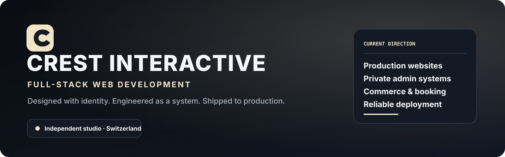
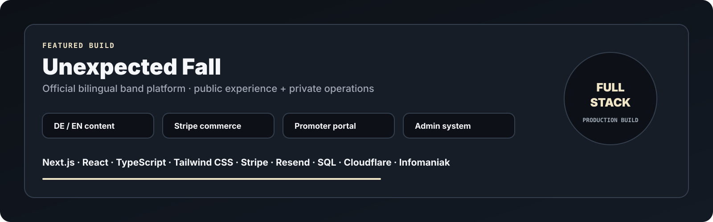
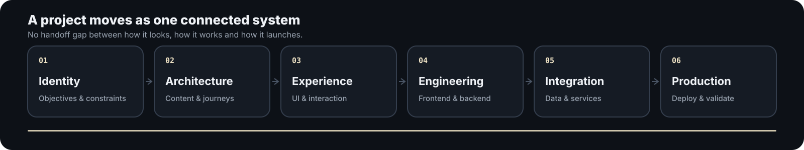
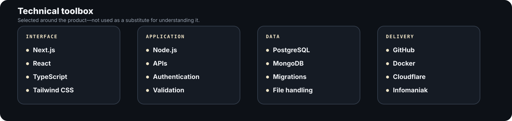

<!--
  CREST INTERACTIVE profile README
  All visual assets are stored locally in ./assets.
  No external stat cards, typing widgets, badge services or remote hero images are required.
-->

<picture>
  <source media="(prefers-color-scheme: dark)" srcset="./assets/hero-dark.svg">
  <source media="(prefers-color-scheme: light)" srcset="./assets/hero-light.svg">
  
</picture>

<p align="center">
  <strong>
    <a href="https://crest-interactive.com">Website</a>
    &nbsp;·&nbsp;
    <a href="mailto:info@crest-interactive.com">Email</a>
    &nbsp;·&nbsp;
    <a href="https://github.com/CREST-Interactive">GitHub</a>
  </strong>
</p>

---

## CREST at a glance

**CREST INTERACTIVE is the independent full-stack web studio of Luno, based in Switzerland.**

I design and engineer websites as complete digital products: the public experience, application logic, private administration, integrations and production deployment are treated as one connected system.

```text
Identity → Structure → Experience → Engineering → Integration → Production
```

> **A website is not finished because it looks good locally.**  
> It is finished when real people can use it, the owner can operate it and the system can continue evolving after launch.

---

## What I build

<table>
<tr>
<td width="50%" valign="top">

### Brand-led websites

Custom websites for artists, businesses and independent brands that need a distinct identity rather than a recycled template.

- Responsive interface systems
- Bilingual and structured content
- Motion, interaction and visual direction
- Search, metadata and social-sharing foundations

</td>
<td width="50%" valign="top">

### Full-stack applications

Application behavior that lives behind the interface and supports real workflows.

- Authentication and protected areas
- Databases, APIs and validation
- Forms, dashboards and file handling
- Role-aware operational tools

</td>
</tr>
<tr>
<td width="50%" valign="top">

### Commerce and booking

Practical systems for turning interest into an actual transaction or conversation.

- Product catalogues and carts
- Stripe Checkout integration
- Booking and inquiry workflows
- Transactional email and status handling

</td>
<td width="50%" valign="top">

### Administration and delivery

The private side receives the same attention as the public-facing product.

- Content and media management
- Inquiry and conversation management
- Environment configuration and migrations
- DNS, hosting, proxying and launch validation

</td>
</tr>
</table>

---

## Featured build

<picture>
  <source media="(prefers-color-scheme: dark)" srcset="./assets/project-dark.svg">
  <source media="(prefers-color-scheme: light)" srcset="./assets/project-light.svg">
  
</picture>

### Unexpected Fall — official band platform

A custom bilingual website and operational platform for Swiss alternative-rock band **Unexpected Fall**.

The project combines the public brand experience, music and media content, show information, merchandise, booking resources and private administration inside one application.

<table>
<tr>
<td width="50%" valign="top">

#### Public experience

- German and English interface
- Custom responsive visual system
- Music, shows, gallery, videos and lyrics
- Merchandise catalogue and product pages
- Booking and contact workflows
- SEO, metadata and legal surfaces

</td>
<td width="50%" valign="top">

#### Application layer

- Server-side Stripe Checkout
- Catalogue-driven commerce
- Protected promoter resources
- Private administration portal
- Inquiry and content management
- Transactional email and production deployment

</td>
</tr>
</table>

<p align="center">
  <strong><a href="https://unexpectedfall.ch">Visit unexpectedfall.ch</a></strong>
</p>

---

## How a CREST project comes together

<picture>
  <source media="(prefers-color-scheme: dark)" srcset="./assets/workflow-dark.svg">
  <source media="(prefers-color-scheme: light)" srcset="./assets/workflow-light.svg">
  
</picture>

The interface is not decoration applied after the technical work. Content structure, UX, application logic, administration and deployment are designed as parts of the same product.

---

## Technical toolbox

<picture>
  <source media="(prefers-color-scheme: dark)" srcset="./assets/stack-dark.svg">
  <source media="(prefers-color-scheme: light)" srcset="./assets/stack-light.svg">
  
</picture>

The exact stack changes with the project. Complexity must solve a real requirement; it does not exist to make the architecture sound impressive.

---

## Engineering standards

| Principle | What it means in practice |
|---|---|
| **Ship the whole product** | Design, forms, data, administration and deployment are all part of the deliverable. |
| **Preserve identity** | Reusable engineering supports a distinct brand instead of flattening every project into the same template. |
| **Design the private side** | Owners, editors and administrators are users too. Internal workflows must be clear and efficient. |
| **Build deliberately** | Dependencies, abstractions and integrations must justify the complexity they introduce. |
| **Treat production as engineering** | Environment variables, migrations, email, payment modes, DNS and launch validation are not afterthoughts. |

---

## Current direction

```typescript
const crest = {
  identity: "Independent full-stack web studio",
  founder: "Luno",
  location: "Switzerland",

  building: [
    "Custom production websites",
    "Commerce and booking systems",
    "Private administration portals",
    "Maintainable deployment foundations",
  ],

  priorities: [
    "Distinctive design",
    "Reliable application behavior",
    "Long-term ownership",
    "Shipping beyond localhost",
  ],

  status: "Building for production",
};
```

The focus now is straightforward: build websites that reach the market, solve an actual problem and remain maintainable once they are live.

---

<details>
<summary><strong>Earlier CREST experiments</strong></summary>

<br>

CREST previously explored ambitious concepts including **Neo RP** and **NeoLog**.

Those projects did not become complete public products, so they are no longer presented as active releases. They remain relevant as development history: interface systems, telemetry, backend logic, application architecture and product thinking developed there now inform the studio's production web work.

**The prototypes stayed behind. The experience did not.**

</details>

---

## Work with CREST

CREST is a strong fit for projects that need more than a generic page assembled from interchangeable sections:

- A custom website for a business, artist or organisation
- A redesign or migration away from a restrictive website builder
- A shop, catalogue, booking or inquiry workflow
- A protected portal for customers, promoters or staff
- A private administration system
- Technical launch preparation and continued development after release

<p align="center">
  <strong>
    <a href="mailto:info@crest-interactive.com">Start a conversation</a>
    &nbsp;·&nbsp;
    <a href="https://crest-interactive.com">Visit CREST INTERACTIVE</a>
  </strong>
</p>

<picture>
  <source media="(prefers-color-scheme: dark)" srcset="./assets/footer-dark.svg">
  <source media="(prefers-color-scheme: light)" srcset="./assets/footer-light.svg">
  
</picture>
